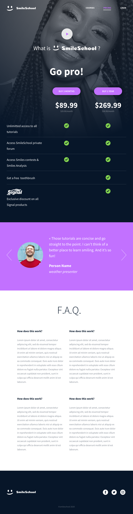

# holberton-smiling-school-javascript

## About

### Project Description
This project is a combination of technologies and concepts we learned about front-end development. These technologies and concepts include HTML, CSS, Bootstrap, JavaScript, jQuery, and responsive design.

### Story
I developed the static HTML and CSS as well as some of the basic Bootstrap features over the course of about a week in another [repository](https://github.com/mlaizure/holberton-smiling-school). Then I spent another week adding the JavaScript, jQuery, and more advanced Bootstrap functionality for the final iteration.

### Features
- Bootstrap grids
- Bootstrap carousel of quotes
- Modified Bootstrap carousel to show multiple cards at a time, but only scroll one at a time
- A keyword search with drop-down menus for filtering results
- jQuery and JavaScript used for dynamic search results and carousel content
- Design includes responsive elements for desktop, tablet, and mobile

### Future features
- Improved accessibility
- Make a fully custom multi-card carousel

### Major challenges
- Attempting to override Bootstrap carousel functionality
- Conforming appearance of drop-downs to design specification

## Author

Hi! My name is Maddi Laizure. In another life I earned a Bachelor of Science Chemical Engineering at the University of Tulsa and worked as an engineer for close to 3 years. I love Irish stepdance and board games.

I did this project as a student at [Holberton School](https://holbertontulsa.com/) where I learned full stack web development.

[LinkedIn](https://www.linkedin.com/in/maddi-laizure/) & [GitHub](https://github.com/mlaizure)

## Screenshots of the pricing page:
  - Desktop layout:

  - Tablet layout:

  - Mobile layout:

