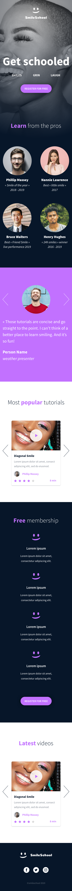

# holberton-smiling-school-javascript
## Build a web app in Java Script
- Carousels and search/filter results are populated from an API
- Custom multi-slide carousel built on top of Bootstrap carousel
- Images from designer file:
  - Desktop layout:

  - Tablet layout:

  - Mobile layout:

